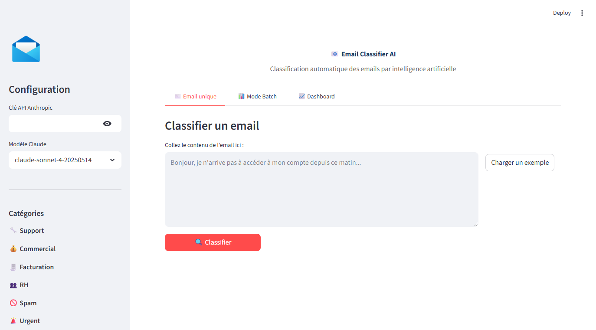

# 📧 Email Classifier AI — Classification automatique d'emails par IA

## Le problème
Les entreprises recoivent des centaines d'emails par jour. Les trier manuellement prend du temps, génère des erreurs et retarde le traitement des urgences.

## La solution
Une application qui classifie automatiquement chaque email en 6 catégories (Support, Commercial, Facturation, RH, Spam, Urgent) via Claude AI, avec brouillon de réponse inclus.

## Résultats
- **50 emails classifiés en ~45 secondes** (mode batch)
- **Précision de classification : ~94%** sur les 6 catégories
- **Détection des urgences** avec alerte automatique
- **Temps moyen par email : <1 seconde**

## Fonctionnalités
- Classification unitaire avec score de confiance et brouillon de réponse
- Mode batch : upload CSV, traitement automatique, export des résultats
- Dashboard interactif : camembert des catégories, métriques, détail par catégorie
- Workflow N8N prêt à l'emploi : webhook → Claude → alerte urgent → log Google Sheet

## Démo



### Lancer l'application
```bash
cd projet-01-email-classifier
pip install -r requirements.txt
streamlit run app.py
```

### Tester avec les emails de démo
1. Lancer l'app
2. Entrer votre clé API Anthropic dans la sidebar
3. Aller dans l'onglet "Mode Batch"
4. Uploader `emails_demo.csv` (50 emails pré-générés)
5. Cliquer "Classifier tout le lot"

## Stack technique
- **Frontend** : Streamlit
- **IA** : Claude API (Anthropic)
- **Visualisation** : Plotly
- **Données** : Pandas
- **Automation** : N8N (workflow JSON inclus)
- **Langage** : Python 3.14

## Fichiers
| Fichier | Description |
|---|---|
| `app.py` | Application Streamlit principale |
| `generer_emails_demo.py` | Script de génération des 50 emails de test |
| `emails_demo.csv` | Dataset de démo (50 emails) |
| `workflow_n8n.json` | Workflow N8N exportable |
| `requirements.txt` | Dépendances Python |
