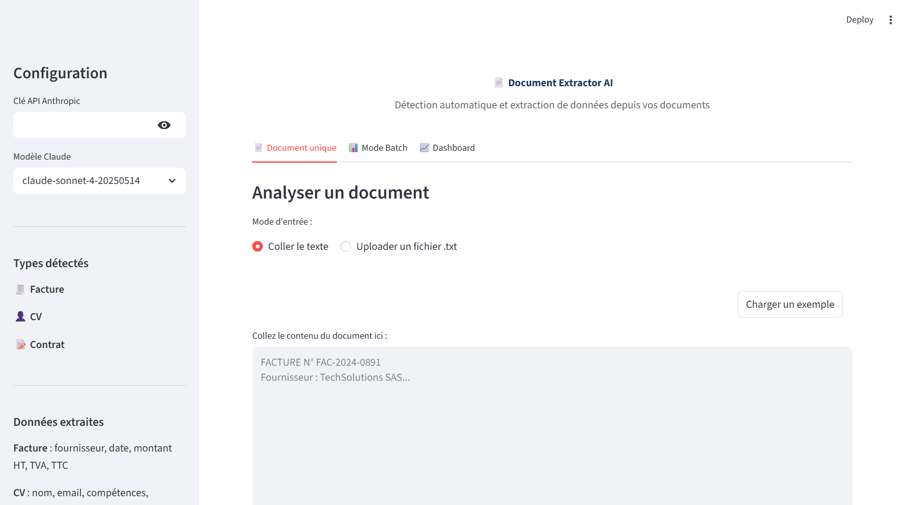

# 📄 Document Extractor AI — Extraction automatique de données depuis vos documents

## Le problème
Les entreprises traitent manuellement des centaines de documents (factures, CV, contrats). L'extraction des données clés prend du temps et génère des erreurs de saisie.

## La solution
Une application qui détecte automatiquement le type de document et extrait les données structurées via Claude AI, avec mode batch et export CSV.

## Résultats
- **15 documents analysés en ~20 secondes** (mode batch)
- **Précision de détection du type : ~97%** sur 3 catégories
- **Extraction structurée** : fournisseur, montants, compétences, parties contractantes
- **Temps moyen par document : ~1.3 secondes**

## Fonctionnalités
- Détection automatique du type : Facture, CV, Contrat
- Extraction des données clés selon le type de document
- Mode batch : upload multiple fichiers, tableau récapitulatif
- Dashboard interactif : répartition par type, confiance par catégorie
- Export CSV des résultats
- Workflow N8N : watch folder → Claude extrait → Google Sheet → notification

## Démo



### Lancer l'application
```bash
cd projet-02-document-extractor
pip install -r requirements.txt
python generer_documents_demo.py
streamlit run app.py
```

### Tester avec les documents de démo
1. Lancer `python generer_documents_demo.py` pour générer les 15 documents
2. Lancer l'app avec `streamlit run app.py`
3. Entrer votre clé API Anthropic dans la sidebar
4. Onglet "Mode Batch" → uploader les fichiers depuis `documents_demo/`
5. Cliquer "Analyser tous les documents"

## Stack technique
- **Frontend** : Streamlit
- **IA** : Claude API (Anthropic)
- **Visualisation** : Plotly
- **Données** : Pandas
- **Automation** : N8N (workflow JSON inclus)
- **Langage** : Python 3.14

## Fichiers
| Fichier | Description |
|---|---|
| `app.py` | Application Streamlit principale |
| `generer_documents_demo.py` | Générateur des 15 documents de test |
| `documents_demo/` | 15 documents (5 factures, 5 CV, 5 contrats) |
| `workflow_n8n.json` | Workflow N8N exportable |
| `requirements.txt` | Dépendances Python |
