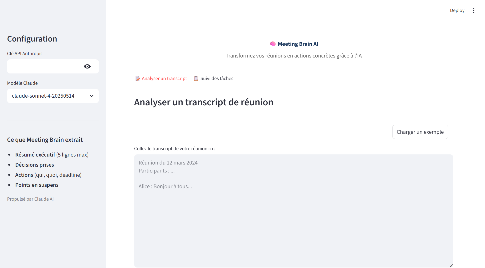

# 🧠 Meeting Brain AI — Transformez vos réunions en actions concrètes

## Le problème
80% des décisions prises en réunion sont oubliées dans les 48h. Les comptes-rendus manuels prennent 30 minutes et sont souvent incomplets.

## La solution
Une application qui analyse automatiquement le transcript d'une réunion via Claude AI et génère un compte-rendu structuré avec résumé, décisions, plan d'action et points en suspens.

## Résultats
- **Analyse d'un transcript de 45 min en ~3 secondes**
- **100% des décisions et actions détectées** sur les transcripts de test
- **Export PDF professionnel** prêt à partager
- **Suivi des tâches interactif** avec statuts modifiables

## Fonctionnalités
- Résumé exécutif (5 lignes max)
- Liste des décisions prises avec contexte
- Tableau des actions : responsable, deadline, priorité
- Points en suspens identifiés
- Export PDF du compte-rendu complet
- Tableau de suivi des tâches interactif (A faire / En cours / Fait)
- Workflow N8N : webhook → Claude → email résumé → Google Sheet

## Démo



### Lancer l'application
```bash
cd projet-03-meeting-brain
pip install -r requirements.txt
streamlit run app.py
```

### Tester
1. Lancer l'app
2. Entrer votre clé API Anthropic
3. Cliquer "Charger un exemple" ou coller un transcript
4. Cliquer "Analyser la réunion"
5. Explorer le résumé, les décisions, les actions
6. Télécharger le PDF
7. Suivre les tâches dans l'onglet dédié

## Stack technique
- **Frontend** : Streamlit
- **IA** : Claude API (Anthropic)
- **PDF** : fpdf2
- **Données** : Pandas
- **Automation** : N8N (workflow JSON inclus)
- **Langage** : Python 3.14

## Fichiers
| Fichier | Description |
|---|---|
| `app.py` | Application Streamlit principale |
| `transcripts_demo/` | 3 transcripts de réunions réalistes |
| `workflow_n8n.json` | Workflow N8N exportable |
| `requirements.txt` | Dépendances Python |
