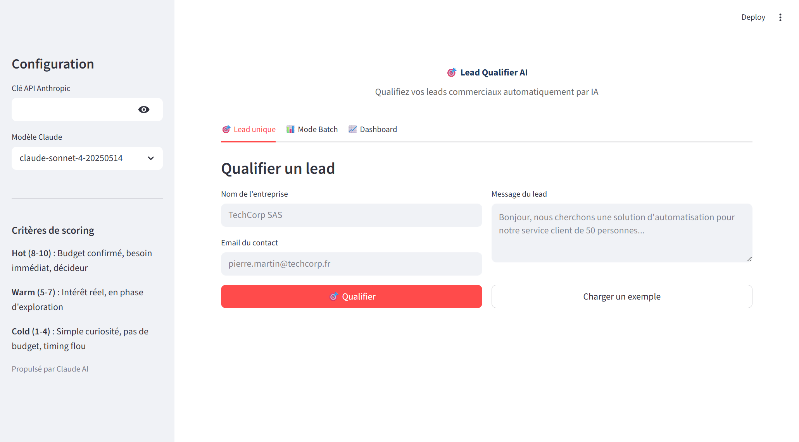

# 🎯 Lead Qualifier AI — Qualification automatique de leads par IA

## Le problème
Les commerciaux passent 40% de leur temps à qualifier des leads manuellement. Les leads chauds sont noyés parmi les curieux et les spams, ce qui retarde le closing.

## La solution
Une application qui analyse automatiquement chaque lead via Claude AI, attribue un score (1-10), catégorise (Hot/Warm/Cold) et génère une réponse personnalisée.

## Résultats
- **50 leads qualifiés en ~50 secondes** (mode batch)
- **Score de qualification 1-10** avec explication détaillée
- **Détection des leads Hot** avec alerte automatique
- **Réponse personnalisée** générée pour chaque lead

## Fonctionnalités
- Qualification unitaire : score, catégorie, signaux positifs/négatifs
- Réponse personnalisée suggérée pour chaque lead
- Mode batch : upload CSV, qualification automatique, tri par priorité
- Dashboard : répartition Hot/Warm/Cold, distribution des scores, top 10
- Export CSV des résultats triés par score
- Workflow N8N : nouveau lead Google Sheet → Claude qualifie → IF Hot → alerte email

## Démo



### Lancer l'application
```bash
cd projet-04-lead-qualifier
pip install -r requirements.txt
python generer_leads_demo.py
streamlit run app.py
```

### Tester avec les leads de démo
1. Lancer `python generer_leads_demo.py` pour générer les 50 leads
2. Lancer l'app avec `streamlit run app.py`
3. Entrer votre clé API Anthropic dans la sidebar
4. Onglet "Mode Batch" → uploader `leads_demo.csv`
5. Cliquer "Qualifier tout le lot"
6. Explorer le dashboard pour voir la répartition

## Stack technique
- **Frontend** : Streamlit
- **IA** : Claude API (Anthropic)
- **Visualisation** : Plotly
- **Données** : Pandas
- **Automation** : N8N (workflow JSON inclus)
- **Langage** : Python 3.14

## Fichiers
| Fichier | Description |
|---|---|
| `app.py` | Application Streamlit principale |
| `generer_leads_demo.py` | Générateur des 50 leads de test |
| `leads_demo.csv` | Dataset de démo (50 leads) |
| `workflow_n8n.json` | Workflow N8N exportable |
| `requirements.txt` | Dépendances Python |
